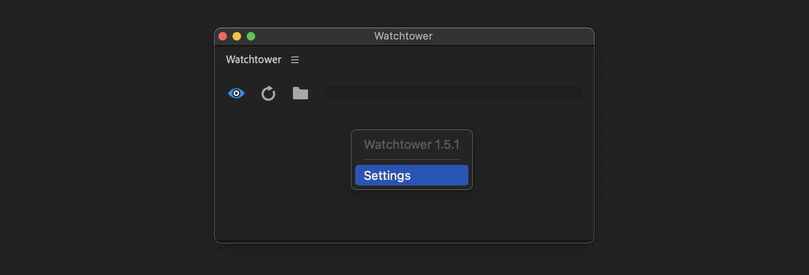
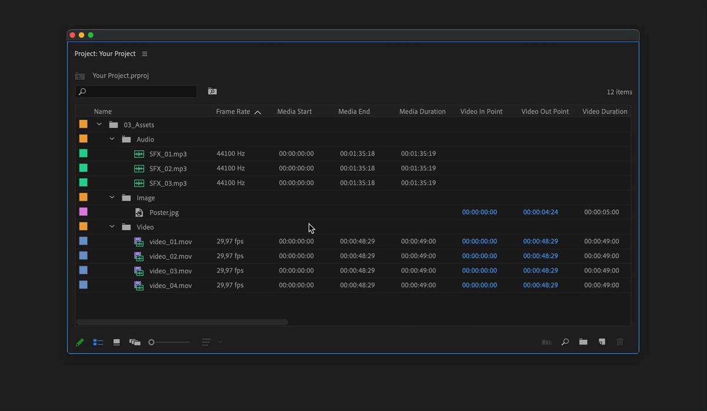

# Settings

To access settings, right-click on the main panel or click on 3 lines (flyout menu).

<figure><figcaption></figcaption></figure>

***

## General

General tab is different for Premiere Pro and After Effects.

### Show import options

If enabled, in Premiere Pro, during import of Illustrator and Photoshop files, a dialogue will appear with options of how to import files.

### Add Import Date

In Premiere Pro, additional metadata `Import Date` will be created for each imported item.\
Date format allows to sort `Import Date` column.

To show `Import Date`, open Metadata Display in project panel and check Import Date.

<figure><figcaption></figcaption></figure>

### Photoshop, Illustrator import as

In After Effects it is possible to choose how to import Photoshop and Illustrator files:

* as footage
* composition
* composition with retained layers sizes.

### Show Notifications

Premiere Pro event will show notification about sync results.\
After Effects will show notification in Info panel.

***

## Allowed Files

Set filter for file extensions to import.


If file extension is not supported by Premiere Pro or After Effects\
file won't be imported.


## Ignored Folders

Set folder names to be ignored during import.

Filter is case insensitive, adding "proxies" will filter out all folders:\
"proxies", "Proxies", "PROXIES", "pRoXiEs" etc.

You can set [**Regex**](regex-folder-name-filter.md) filter as well, put regex pattern between two slashes: "/\_AME/"


When new folder created inside watch folder, "untitled folder" (or another name, depending on OS language) will be immediately added to project, before you have time to rename it.

To avoid this, add "untitled folder" to folder name filter in settings

