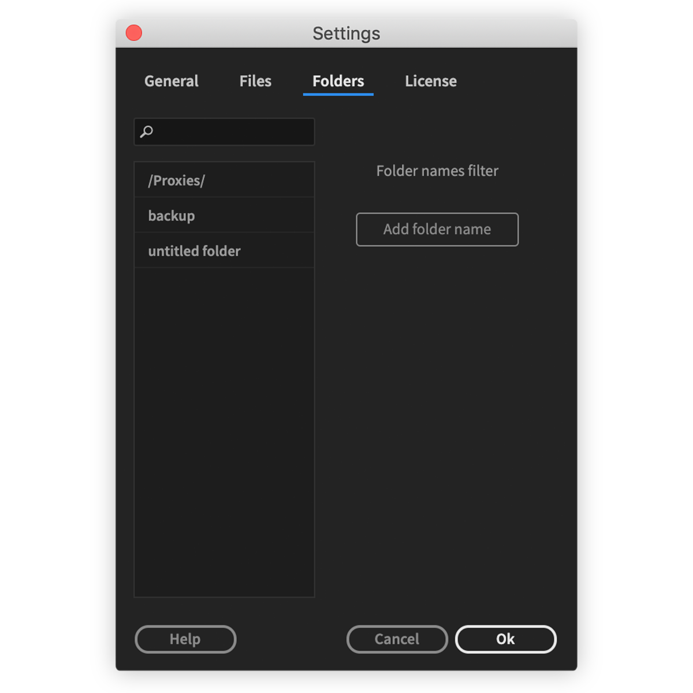

# Settings

## General

General tab is different for Premiere Pro and After Effects.

#### **Auto sync**

Project will be synced every time file or folder added to watch folder. Watchtower panel can be closed and auto import will still happen in background. Auto sync works across multiple opened projects in Premiere Pro.

#### Show import options

In Premiere Pro when syncing bins a dialogue will appear and ask how to import files.  
It works for Premiere Pro, Illustrator and Photoshop project files.

#### Photoshop, Illustrator import as

In After Effects it is possible to choose how to import Photoshop and Illustrator files:  
as footage, composition or composition with retained layers sizes.

#### Notifications

Premiere Pro event will notify you about sync results.  
After Effects will show notification in Info panel.

#### Share anonymous usage data

This helps me as a developer to see which Watchtower features are useful and which are not. [See what data is collected](anonymous-usage-data.md).

#### Updates

When update will be available, download buttons will appear here.

## Files

Set filter for file extensions to import.  
You can toggle checkbox and add/delete file extension.


If file extension is not supported by Premiere Pro or After Effects  
file won't be imported.


## Folders

Set folder names to be ignored during import.

Filter is case insensitive, adding "proxies" will filter out all folders:  
"proxies", "Proxies", "PROXIES", "pRoXiEs" etc.

You can set [**Regex**](regex-folder-name-filter.md) filter as well, put regex pattern between two slashes: "/\_AME/"


When new folder created inside watch folder, "untitled folder" \(or another name, depending on OS language\) will be immediately added to project, before you have time to rename it.

To avoid this, add "untitled folder" to folder name filter in settings


## License

In License tab you can see/copy license code used on current computer.  
It is possible to deactivate license on current machine.


if you need to deactivate license on a computer you don't have access to,  
use [License Management](../../../website/license.md) on website.


