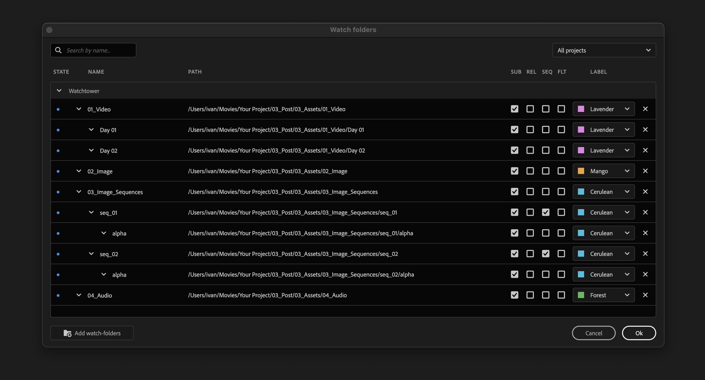
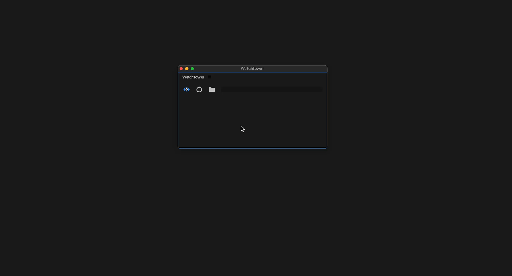
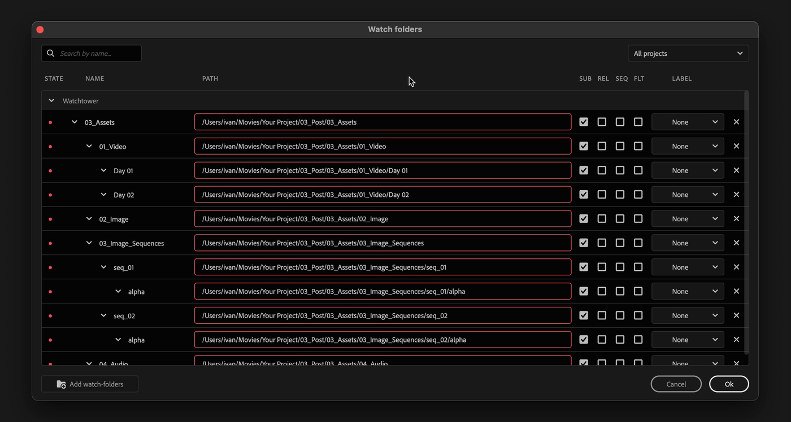

# Watch-folders manager

<figure><figcaption></figcaption></figure>

## Add watch-folders

Select folders in your file browser and drag'n'drop them on watch-folders manager.

Or click on "add watch-folders" button.

On Windows it is also possible to add junction directories as watch-folders.

<figure><figcaption></figcaption></figure>


To fold/unfold all folders quickly, hold **opt/alt** down and click on a fold arrow near the folder name.


## Watch-folder settings

<table><thead><tr><th width="135">Setting</th><th>Description</th></tr></thead><tbody><tr><td><strong>Path</strong></td><td>Path to a watch-folder. Click on it to change it.</td></tr><tr><td><strong>SUB</strong></td><td>Import or ignore subfolders.</td></tr><tr><td><strong>REL</strong></td><td>Use path relative to project location. This is useful for project templates. Relative path will also switch when moving project file between macOS and Windows, so there is no need to relink watch-folders.</td></tr><tr><td><strong>SEQ</strong></td><td>Import images as image sequences.</td></tr><tr><td><strong>FLT</strong></td><td>Flatten sub-folders: all files will be imported in a parent folder. This is useful for camera cards or image sequences that are placed each in a sub-folder.</td></tr><tr><td><strong>Label</strong></td><td>Assign label to a bin and new items imported in that bin. Great to label media files automatically (e.g. Whooshes are green, Drones are blue)</td></tr></tbody></table>

### Settings inheritance

Changing the settings of a parent folder automatically updates the settings of its child folders — making it faster to customize or delete your watch folders.

When a new subfolder is added to a watch folder, it inherits all the settings from its parent.

***

## Image sequence detection

Watchtower will automatically detect folder with image sequences inside and enable SEQ checkbox for them.

To be detected image sequence should have 3 and more digits at the end of filename:​

| File name                   | Image sequence detected |
| --------------------------- | ----------------------- |
| cleanup\_000 – cleanup\_999 | ✅                       |
| page\_00000 – page\_99999   | ✅                       |
| sframe\_00 – sframe\_99     | ❌                       |

## Camera folders detection

Watchtower will automatically detect camera folder structures and enable FLT checkbox for them.

#### Supported camera folders:

* ARRIRAW
* RED
* AVCHD
* Canon XF
* Panasonic P2
* XDCAM-EX
* XDCAM-HD
* Sony HDV
* Sony a7S
* Sony FS/XAVC
* DCIM


Need more? Write to [support@knightsoftheeditingtable.com](mailto:support@knightsoftheeditingtable.com)


***

## Relink offline folders

If watch folders go offline, link the parent folder manually and the subfolders will relink automatically.

<figure><figcaption></figcaption></figure>
