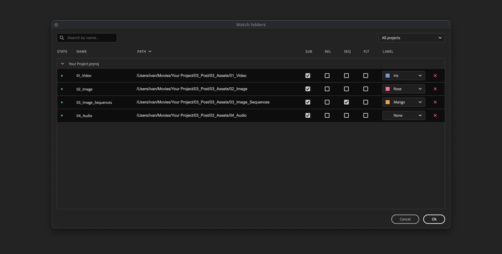
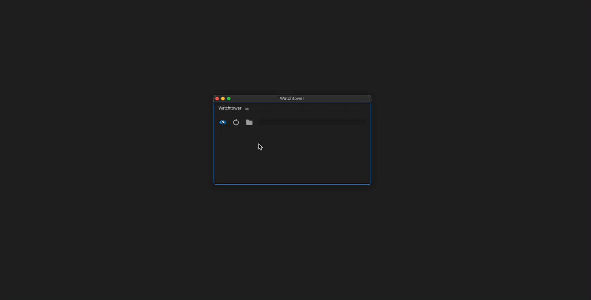

# Watch-folders manager

<figure><figcaption></figcaption></figure>

## Add watch-folders

Select folders in your file browser and drag'n'drop them on watch-folders manager.

<figure><figcaption></figcaption></figure>


Watchtower automatically will detect:

* camera folder structures and enable FLT checkbox for such folders
* folders with [image sequences](image-sequence-detection.md) inside and enable SEQ checkbox


## Watch-folder settings

### **PATH**

Path to a watch-folder. You can click on it and change it.

### SUB

Import or ignore subfolder.

### REL

Use path relative to project location. This is useful for project templates.

### SEQ

Import images as image sequences.

### FLT

Flatten sub-folders: all files will be imported in a parent folder. This is useful for camera cards or image sequences that are placed each in a sub-folder.

### LABEL

Assign label to a bin and new items imported in that bin. Great, if you want your media be labeled automatically (e.g. Whooshes are green, Drones are blue)
