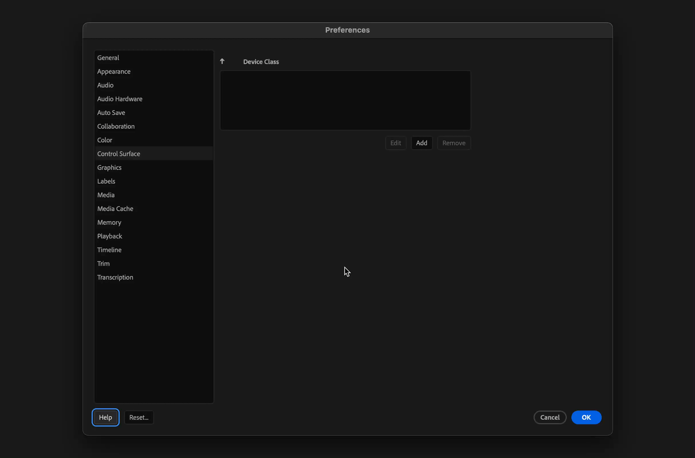

# Merlin

Merlin is a control surface plugin that gives extensions even more control over Premiere Pro than just by using the API.

## Installation

Merlin will be automatically installed with the main extension.

It is only needed to add Merlin as a control surface in Premiere Pro preferences.

<figure><figcaption></figcaption></figure>


Make sure to add Merlin control surface again,\
after major update of Premiere Pro (2025, 2026, etc)


If Merlin is not loaded, you will get a warning:

<figure><figcaption></figcaption></figure>
