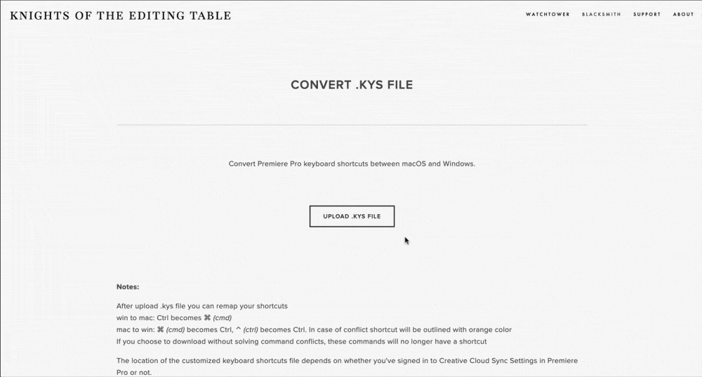

# Convert .kys file

Convert Premiere Pro keyboard shortcuts between macOS and Windows.



After upload .kys file you can remap your shortcuts.



**⌘** _(cmd)_ becomes **Ctrl**, **⌃**_(ctrl)_ becomes **Ctrl**

In case of conflict shortcut will be outlined with orange color.


If you choose to download without solving command conflicts, these commands will no longer have a shortcut




**Ctrl** becomes **⌘** _(cmd)_



The location of the customized keyboard shortcuts file depends on whether you've signed in to Creative Cloud Sync Settings in Premiere Pro or not.



Signed into Creative Cloud Sync Settings

```
Users/[username]/Documents/Adobe/Premiere Pro/[version]/Profile-CreativeCloud-/Mac/
```

Signed out of Creative Cloud Sync Settings

```
Users/[username]/Documents/Adobe/Premiere Pro/[version]/Profile-username/Mac/
```



Signed into Creative Cloud Sync Settings

```
Users\[username]\Documents\Adobe\Premiere Pro\[version]\Profile-CreativeCloud-\Win\
```

Signed out of Creative Cloud Sync Settings

```
Users\[username]\Documents\Adobe\Premiere Pro\[version]\Profile-username\Win\
```




More information about keyboard shortcuts in Premiere Pro on [official website](https://helpx.adobe.com/premiere-pro/using/keyboard-shortcuts.html)

