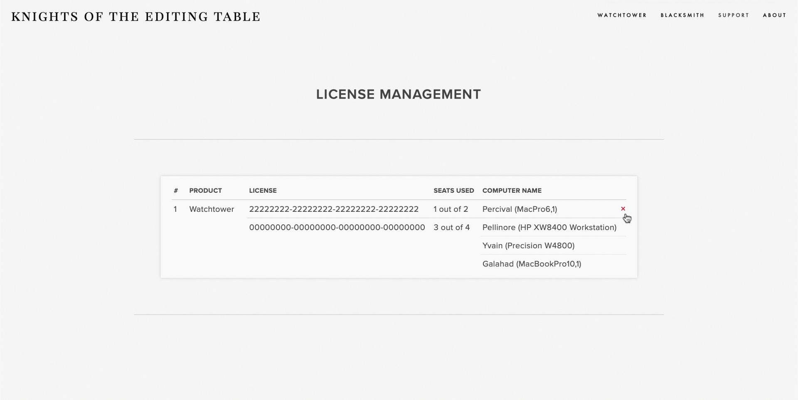
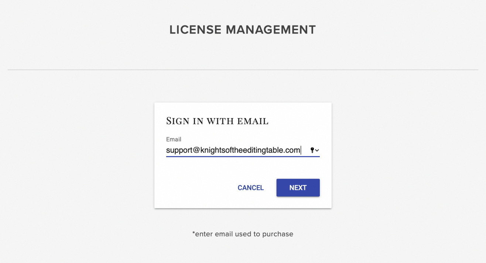
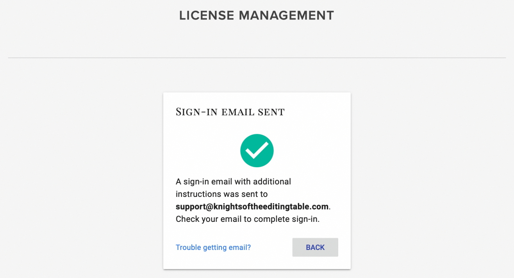
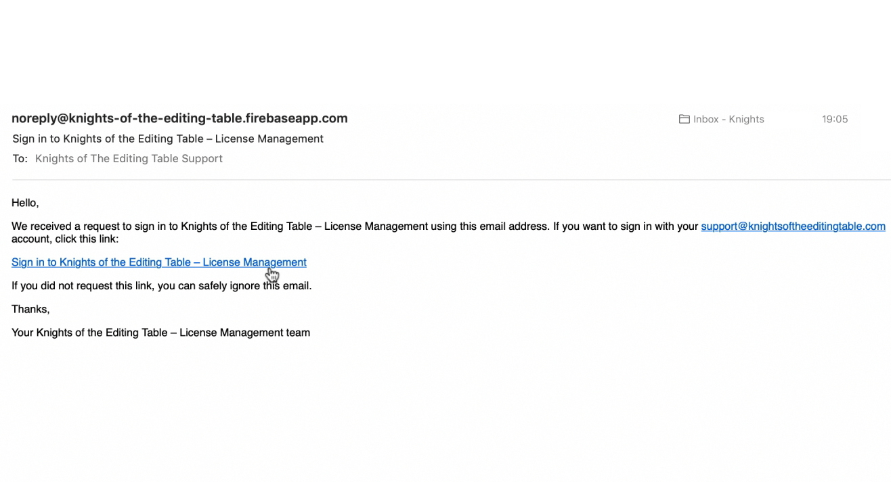
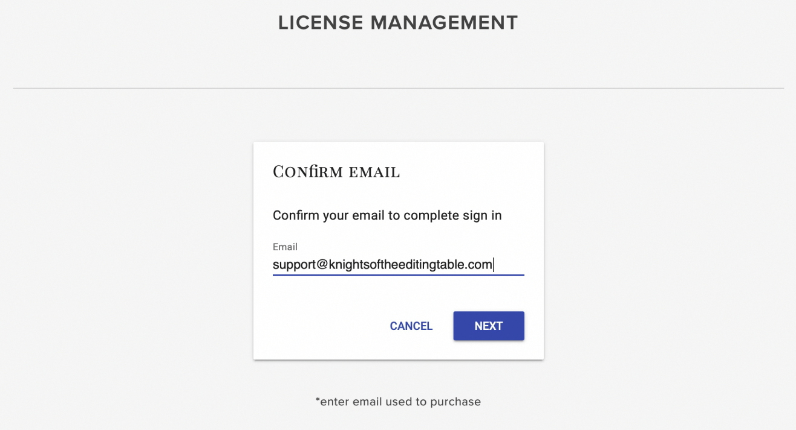
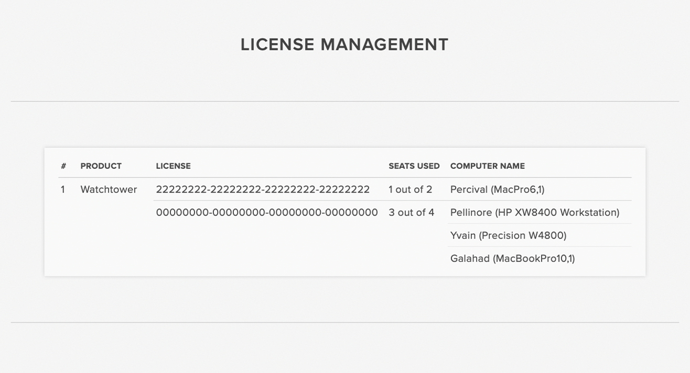

# License Management



License management allows you to control usage of your licenses online.

Here you can see how many seats are used and also deactivate computers.

## Sign-in

License Management uses email authentication.

#### 1\) Enter email used to purchase.

#### 2\) A sign-in email will be sent to the email you entered.

#### 3\) Click the link in the email you received.

#### 4\) Enter email again to confirm.

#### 5\) Welcome to License Management!

