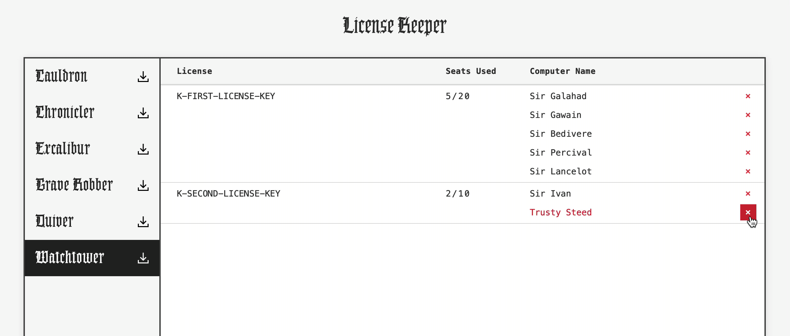
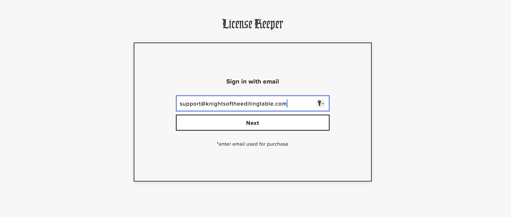
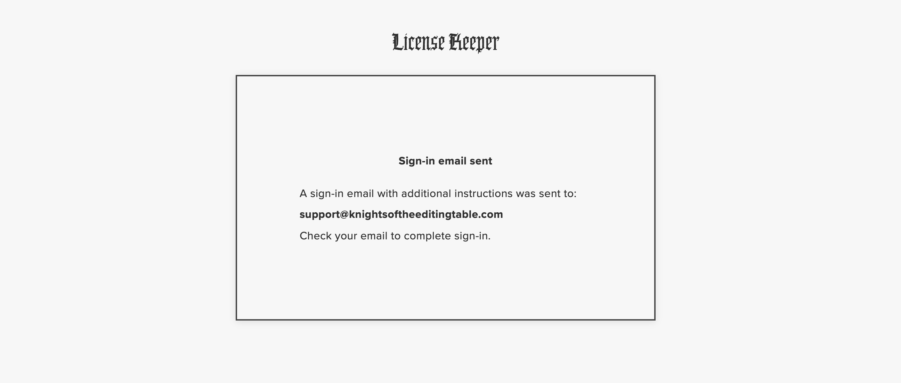
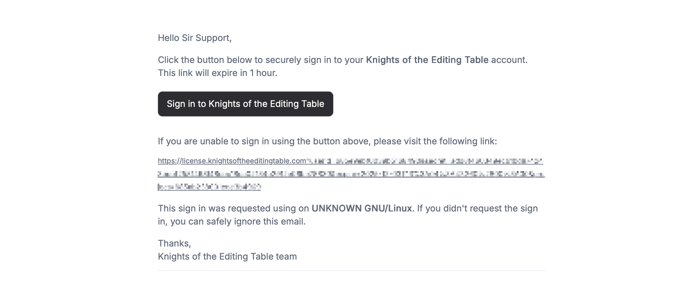

# License Keeper

[**License Keeper**](https://license.knightsoftheeditingtable.com/) allows you to control usage of your licenses online and download installer files.

Here you can see how many seats are used and also deactivate computers.

## Sign-in

License Keeper uses email authentication.

1. Enter email used to purchase.

2. A sign-in email will be sent to the email you entered.

3. Click the link in the email you received.

4. Welcome to License Management!

Hover over a computer name and click on a red cross to deactivate license.

